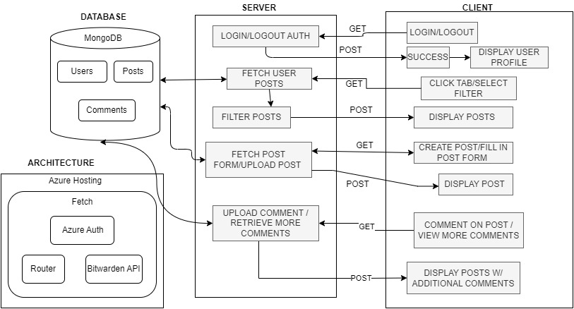

# INFO 441 Final Project Proposal: Gone Phishing

Deployed Website: https://gone-phishing.fourfouronedemo.me

## Project Description

Welcome to Gone Phishing! An oasis for those to post their phishes that they’ve caught throughout the day! Phishes, as we like to call it, are any text, email, or phone calls that users have received throughout the day that seem like a scam or are phishing attempts. Any middle class worker may encounter a phish from someone or some company that they might know of, making them our target audience. It could be the user’s banking company contacting them about their faulty transaction and to ask for them to give the amount back for example. Perhaps out of curiosity about the authenticity of the phish, or out of spite that it is such a blatant scam, users may want to take a screenshot of it and share their experience/thoughts. Through posting and interacting on Gone Phishing, users have the ability to warn others about potential scams, engage in productive discourse, and in some cases turn the tables on scammers.

Whether it is for entertainment to see a community debate whether a phishing post is real or not, the personal satisfaction of being able to compile your own list of phishing scams and to share it with others to critique, or the rage that boils from users who have also been receiving much of the same phishing attempts, people can come to Gone Phishing to not only raise awareness of the issues of phishing in our daily lives, but to also interact with those of like mind and share your harrowing experiences with scams.

We at Gone Phishing believe in empowering the community of everyday workers to laugh at phishing scams and share your experiences to educate others about phishing scams. Through community building and information exchange, our goal is to help educate everyday workers on identifying and avoiding phishing scams and enhance online security for everyone in our community.

## Technical Description
### Architectural Diagram

### User Stories
| Priority |  User  | Description | Technical Implementation |
|-----|--------|------|------|
| P0   |  As a user  |  I want to login using my Microsoft account so that I can interact with the community and contribute to improving internet safety.  |  **Azure authentication** with Microsoft accounts.  |
| P0   |  As a user  |  After logging in, I want the ability to create posts about my encounters with phishing scams so that I can share my experiences with other users and increase awareness in the community.  |  When creating a post, store the post information and metadata in the “posts” collection. We will be using  **MongoDB** for our database. Endpoint: POST /api/post  |
| P0   |  As a user  | After logging in, I want the ability to upload a screenshot and add it to my post so that I share my experience with phishing scams with the community. |  When creating a post, store images in the /public/userScreenshots directory and store the path associated with the post in the “posts” collection. Also for security reasons, we will only allow JPEG/PNG files and randomize file names. |
| P0   |  As a user  |  After logging in, I want the ability to comment on other posts so that I can share my insights and experiences with similar phishing scams and interact with others on the platform.  |  When adding a comment to a post, store the comment information and metadata in the “comments” collection. Endpoint: POST /api/comment  |
| P0   |  As a user  |  I want to view all the posts on the homepage so that I can stay updated on recent phishing scams others in the community have encountered.  |  When the website starts up, get all posts from the “posts” collection. Endpoint: GET /api/posts  |
| P0   |  As a user  |  After logging in, I want the option to post/comment anonymously so that I can talk about my experiences with phishing incidents without feeling embarrassed and gain insights from others while maintaining my privacy.  |  When adding a post/comment to the database, store a boolean indicating whether the user wants it to be anonymous or not.    |
| P0   |  As a user  |  I want to filter posts using tags for different types of phishing scams, scam frequency, and related organizations so that I can learn more about them and have more control over the posts that I see.  |  When the user selects tags to filter by on the posts page, go through the “posts” collection and retrieve posts with matching tags. Endpoint: GET api/posts? stype=[scam type]&otype=[organization type]&frequency=[frequency] |
| P1   |  As a user  |  I want to gain points for my contributions through posts and comments so that I can improve my reputation within the community.  |  When a user’s posts/comments get upvoted add 1 point to their reputation score. Endpoint: POST /users/upvote  |
| P2   |  As a user  |  I want a page to view basic statistics on user posts (e.g. what are the most common phishing scams being talked about) so that I can get an overview of trends in the community.  |  Get data on the types of phishing scams, scam frequency, and related organizations from the “posts” collection. Use results to determine which scams happen the most frequently and the organizations typically involved to create a basic report for the post statistics. Endpoint: GET /api/stats |
| P3   |  As a user  |  I want to reply to comments under posts so that I can engage in further discussion about phishing scams with others in the community.  |  When adding a reply to a comment, store the reply information and other metadata in the “replies” collection. Endpoint: POST /api/reply  |
| P3   |  As a user  |  I want to have private chat groups so that I can communicate directly with other users in the community to share our experiences and ways to deal with phishing incidents.  |  Information and metadata on each chat group is stored in the "groups" collection and messages are stored in the "messages" collection. Handle chat updates with **websockets** for a smooth and fast user experience. Endpoint: POST /api/chatroom  |

### Endpoints
#### GET Handler Endpoints
- /
  - Our homepage to explain our ideals and how we expect users to use the website. (not so important, just client side)
- /posts
  - A tab for our posts page to display all posts.
- Controllers:
  - /api
    - This is where we route to the other controller endpoints. A hub for all controllers.
  - /api/posts
    - A way to load all the posts by users. (return an array of json objects that has post info)
    - We can also get the query parameters to only return posts that match the filters selected. (/posts?stype=’scamtype’&otype=’organizationtype’&frequency=’frequencytype’)
  - /api/comments
    - Within posts we can load up the list of comments associated to the post depending on the post id. (returns an array of json objects) We can probably use post id to find comments to filter back.
  - /api/reply (optional)
    - Will retrieve a list of replies to a comment based on the comment id
  - /api/chatroom (optional)
    - Will retrieve the history of chats for a given chatroom.
- Users.js (azure user authentication)
  - /users/id
    - To get the user id and check if they’re authenticated
  - /users/profile
    - Also to check if the user is authenticated and to return a user profile.
    - In the user profile we can also have a client side box to either display the user’s posts or comments. Clicking on either choice will clear the box, and display the intended list of comments/posts. (Client Side which should route to the server side to retrieve the list of comments/posts by the user.)
- Auth.js (azure user authentication)
  - /users/signin
    - Signin authentication
  - /users/signout
    - Signing out of the their account
  - /users/acquiretoken
    - Find the saved user data in system for login/other procedures
  - /users/redirect
    - Authenticate and redirect to URI

#### POST Handler Endpoints
- /api/posts
  - Saves a new post from a user to the database
- /api/comments
  - Saves a new comment to the associated post. The post id can be derived from the current page’s post metadata.
- /api/reply (optional)
  - Saves a new reply to a comment/another reply.
- /api/chatroom (optional)
  - Create a new message in the chatroom.

## Appendix
### Database Schemas
- User
  - UserID
  - PostID (saved posts)
  - CommentID (saved comments)
  - points
- Comment
  - CommentID
  - UserID (associated user)
  - PostID (associated post)
  - comment
  - commentDate
- Post
  - PostID (associated post)
  - UserID (associated user)
  - postDescription
  - commentListID (child comments)
  - postDate
  - postImagePath (path to screenshot in public directory)
- Reply (optional)
  - ReplyID
  - CommentID (comment to reply to)
  - UserID (associated user)
  - reply (the reply itself)
  - replyDate

